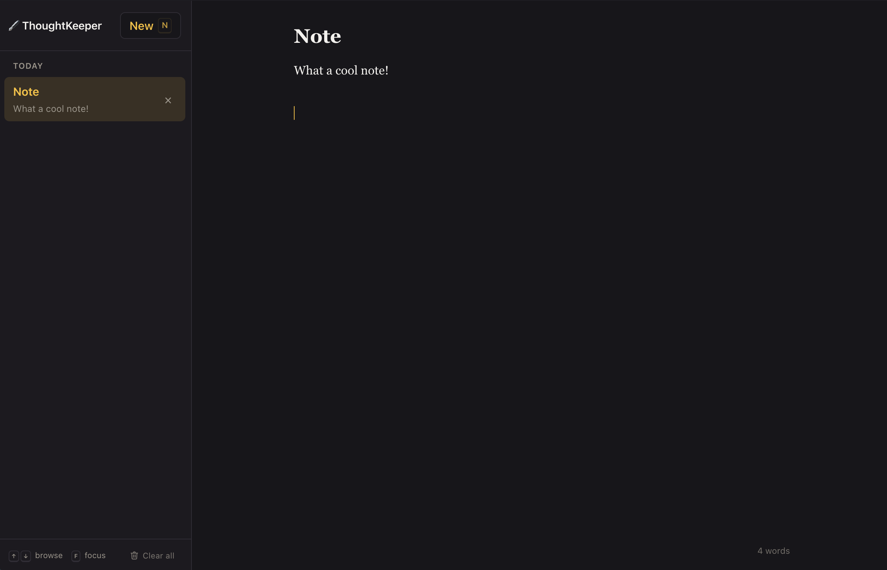

# ThoughtKeeper

A keyboard-driven notes app that keeps everything in your browser. No account, no sync, no server — you open it and start writing.

**[Live demo →](https://www.joaoatan.co.uk/project3/)**



Built with TypeScript and Vite. No UI framework, no runtime dependencies, about 6 kB gzipped.

## Features

- **Write immediately** — no sign-up, no setup, no empty-project ceremony
- **Keyboard-first** — create, browse, edit, and delete without touching the mouse
- **Focus mode** — collapses the sidebar down to just the writing column
- **Undo delete** — a 6-second window to take it back, via the toast or `Cmd+Z`
- **Automatic saving** — debounced while you type, flushed if the tab closes mid-keystroke
- **Date grouping** — notes bucket into Today, Yesterday, Previous 7 days, and Earlier
- **Live word count**
- **Dark mode** — follows your system preference
- **Respects `prefers-reduced-motion`**
- **Works on phones** — the sidebar becomes a drawer below 640px

## Keyboard shortcuts

| Key | Action |
| --- | --- |
| `N` | New note |
| `↑` `↓` | Browse notes |
| `Enter` | Jump into the note body |
| `F` | Toggle focus mode |
| `Cmd/Ctrl` + `\` | Toggle focus mode (works while typing) |
| `Backspace` / `Delete` | Delete the selected note |
| `Cmd/Ctrl` + `Z` | Undo the last delete |
| `Esc` | Dismiss the toast, leave the editor, or exit focus mode |

Single-key shortcuts are suppressed while the caret is in the title or body, so letters stay letters. `Cmd+Z` is only intercepted when an undo is actually on offer — the rest of the time the textarea keeps its native text undo.

## Where your notes live

In `localStorage`, in your browser, on your device. Nothing is uploaded and there is no server to upload it to — so nobody else can read your notes, and equally, they don't follow you to another browser or device. Clearing your browser data deletes them.

Stored data is versioned and validated on load: malformed or hand-edited storage degrades to an empty list rather than crashing the app.

## Running locally

Requires Node 20.19+ or 22.12+.

```bash
npm install
npm run dev
```

## Building

```bash
npm run build    # typecheck, then build to dist/
npm run preview  # serve dist/ at the deployed path
```

The build is a static bundle — any file host will serve it.

`vite.config.ts` sets `base: '/project3/'` because the demo is deployed to a subfolder. If you're hosting at a domain root, change it to `'/'` or asset URLs will resolve to the wrong place.

## Project structure

```
src/
  main.ts      state, rendering, and event wiring
  notes.ts     pure functions over the note list
  storage.ts   localStorage persistence and validation
  types.ts     shared types
  style.css    all styling
```

`notes.ts` holds no DOM references and no state — everything in it is a pure function over a `Note[]`, which keeps the list logic testable in isolation from the UI.

## Notes on the build

The DOM is built with `createElement` and `textContent` throughout — there is no `innerHTML` anywhere in the source, so note content can never be parsed as markup.

There are no runtime dependencies. TypeScript and Vite are the only entries in `package.json`, both dev-only, so nothing third-party ships to the browser.

## License

MIT — see [LICENSE](LICENSE).
